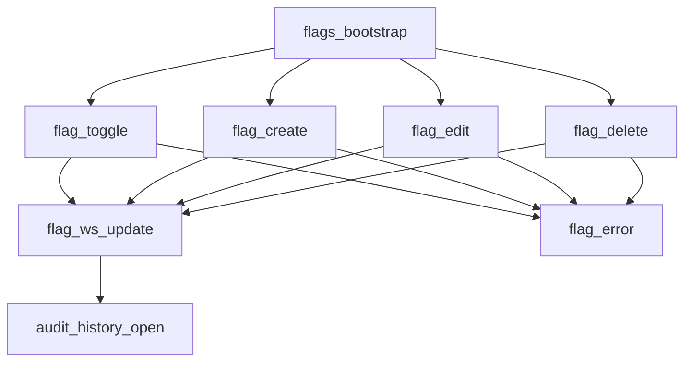

# ⚙️ CROWN⁴ Feature Flags Admin Event Sequencing & Logic Flow

**"Control as Clarity — Governance That Feels Intentional."**

---

## 1️⃣ Global Philosophy

> "The Mina Feature Flags admin panel is a governance control center — every toggle a signal of intent, every change a traceable decision."

Each event embodies:

- **Atomic precision** → One logical truth per flag mutation.
- **Deterministic order** → Every update processed chronologically, never guessed.
- **Audit transparency** → Complete history of who changed what and when.
- **Emotionally-balanced flow** → Every change is smooth, confident, and deliberate.
- **Idempotent integrity** → Replays never duplicate.
- **Real-time synchronization** → Multi-tab consistency via WebSocket broadcasts.

---

## 2️⃣ Lifecycle Overview

```
User Action (Toggle / Create / Edit / Delete)
→ Immediate Optimistic UI Update
→ Backend Mutation (REST API)
→ Audit Log Creation
→ Cache Invalidation
→ Server Confirmation
→ WebSocket Broadcast (Multi-tab Sync)
→ UI Reconciliation (Truth Merge)
→ Toast Notification Feedback
```

💡 **Principle**: Instant optimism, guaranteed truth — governance you can trust.

---

## 3️⃣ Event Sequence (Control → Transparency → Trust)

| # | Event Name | Trigger Source | System Actions | UI Behaviour | User Experience Outcome |
|---|---|---|---|---|---|
| 1 | `flags_bootstrap` | Page open / return | Load flags via API → render cards | Staggered card fade-in | Feels instantly organized |
| 2 | `flag_toggle` | Toggle switch tap/click | Optimistic flip → POST to API → audit log | Switch animates smoothly | "✅ Feature enabled." |
| 3 | `flag_create` | "New Flag" button | Open modal → validate → POST → broadcast | Modal slide-in → success toast | "✨ Flag created successfully." |
| 4 | `flag_edit` | Edit button click | Open modal with data → validate → POST → broadcast | Modal slide-in → success toast | "📝 Flag updated." |
| 5 | `flag_delete` | Delete button + confirm | Confirmation dialog → DELETE API → remove from UI | Card slide-out → toast | "🗑️ Flag deleted." |
| 6 | `flag_search` | Search input typing | Local fuzzy match → filter cards | Instant reflow animation | Fast, intuitive filtering |
| 7 | `flag_ws_update` | WebSocket broadcast | Merge remote change → update UI | Soft shimmer on changed card | Multi-tab stays in sync |
| 8 | `audit_history_open` | History icon click | Load audit logs for flag → render timeline | Slide-in panel with timeline | Complete transparency |
| 9 | `flag_error` | API failure / validation | Rollback optimistic change → show error toast | Red shake animation → rollback | "⚠️ Failed to update. Reverted." |
| 10 | `empty_state_display` | No flags exist | Render empty state illustration | Gentle fade-in with CTA | "Create your first flag" |

---

## 4️⃣ Event Flow Narrative

### 🟢 Stage 1 — Arrival: Instant Organization

- Flags load in cards (not table) with glassmorphism effects
- Staggered animations create premium feel
- Search bar ready for instant filtering
- Visual hierarchy: enabled flags highlighted with gradient accent

💡 **Principle**: Control feels organized from first glance.

---

### 🔵 Stage 2 — Interaction: Confident Control

- Toggle switches flip with smooth animation
- Optimistic updates feel instant
- Server confirmation happens silently
- Multi-tab sync keeps all views consistent

💡 **Principle**: Every action feels immediate and authoritative.

---

### 🟣 Stage 3 — Transparency: Complete Audit Trail

- Every change logs: who, what, when, old value, new value
- History panel shows chronological timeline
- Audit logs persist indefinitely for compliance
- Clear visual distinction between system and user actions

💡 **Principle**: Governance requires complete transparency.

---

### ⚪ Stage 4 — Safety: Reversible Decisions

- Confirmation dialogs prevent accidental deletes
- Failed mutations rollback automatically
- Error states show clear retry options
- Undo capability (via audit log restoration)

💡 **Principle**: Safety nets enable confident experimentation.

---

## 5️⃣ System Logic Blueprint



### Subsystem Details

| Stage | Service | Core Operation | Guarantee |
|---|---|---|---|
| **FlagMutationService** | State manager | Optimistic updates + rollback | Instant feedback |
| **AuditLogger** | Change tracker | Record every mutation | Complete history |
| **WebSocketBroadcaster** | Multi-tab sync | Broadcast all changes | Consistent state |
| **ValidationService** | Input validator | Prevent invalid flags | Data integrity |
| **AuthorizationService** | Role checker | Admin-only access | Security enforcement |

---

## 6️⃣ Concurrency & Synchronisation Safeguards

- **Optimistic Locking**: Version field prevents concurrent edit conflicts
- **Audit Sequencing**: Every change gets monotonic sequence number
- **WebSocket Fanout**: All tabs receive updates via `/flags` namespace
- **Rollback on Failure**: Failed mutations revert UI to previous state
- **CSRF Protection**: All mutations require valid token
- **Idempotent APIs**: Duplicate requests produce same result

💡 **Result**: Zero data loss, zero desync, zero unauthorized changes.

---

## 7️⃣ Error & Recovery Logic

| Scenario | Automatic System Response | User-Visible Behaviour |
|---|---|---|
| **WS disconnect** | Queue changes locally → replay on reconnect | Subtle "reconnecting" indicator |
| **Toggle fails** | Rollback switch position → show error toast | Switch flips back with error message |
| **Validation error** | Prevent submission → highlight fields | Red border + inline error text |
| **Unauthorized** | Redirect to login | "Session expired. Please log in." |
| **Network timeout** | Retry with exponential backoff | Loading spinner → retry toast |

💡 **Recovery Principle**: Never an error — only a moment of guided resolution.

---

## 8️⃣ Emotional Architecture Layer

| Event | Emotion | Cue |
|---|---|---|
| `flags_bootstrap` | Organization | Clean grid layout with staggered fade |
| `flag_toggle` | Confidence | Smooth switch animation with haptic feedback |
| `flag_create` | Achievement | Success toast with checkmark animation |
| `flag_edit` | Control | Modal slide with form focus |
| `flag_delete` | Caution | Confirmation dialog with warning color |
| `audit_history_open` | Transparency | Timeline with user avatars |
| `flag_error` | Guidance | Clear error message with retry button |

**Mina maintains emotional consistency**: Deliberate and trustworthy.

---

## 9️⃣ Observability & Telemetry

Each event logs to `flag_telemetry`:

```json
{
  "trace_id": "...",
  "event_name": "flag_toggle",
  "flag_key": "ai_copilot_beta",
  "old_value": false,
  "new_value": true,
  "user_id": "user_123",
  "latency_ms": 87,
  "success": true,
  "timestamp": "2025-10-28T16:42:00Z"
}
```

### Metrics Monitored:

- **Toggle latency** (target < 200ms)
- **API success rate** ≥ 99.9%
- **Audit log completeness** = 100%
- **WebSocket sync delay** < 500ms
- **Unauthorized access attempts** → alert

💡 **Purpose**: Quantify control — measure governance reliability.

---

## 🔟 Security & Privacy

- **Role-Based Access**: Only admin users can access `/ui/admin/flags`
- **JWT Authentication**: Valid session required for all mutations
- **CSRF Protection**: Token validation on all POST/DELETE
- **Audit Immutability**: Logs cannot be deleted or modified
- **Encryption**: Sensitive flag notes encrypted at rest
- **Rate Limiting**: Max 100 mutations per minute per user

---

## 1️⃣1️⃣ Performance & Scalability Standards

| Metric | Target | Mechanism |
|---|---|---|
| **Page load (TTI)** | ≤ 300ms | API flags endpoint optimized |
| **Toggle response** | ≤ 200ms | Optimistic UI + background API |
| **Search filter** | ≤ 50ms | Client-side fuzzy match |
| **Audit log fetch** | ≤ 500ms | Indexed queries on timestamp |
| **WebSocket propagation** | ≤ 300ms | Direct broadcast to all clients |

---

## 1️⃣2️⃣ Business & Technical Harmony

| Dimension | User Value | Business Impact |
|---|---|---|
| **Instant toggles** | Fast experimentation | Faster feature rollout |
| **Audit transparency** | Trust in governance | Compliance readiness |
| **Multi-tab sync** | Consistent view | Prevents confusion |
| **Error recovery** | Safe mutations | Reduces support tickets |
| **Access control** | Secure operations | Prevents unauthorized changes |

---

## 1️⃣3️⃣ Risk-Hardened Design Summary

| Risk | Mitigation | Status |
|---|---|---|
| **Unauthorized access** | JWT + RBAC | ✅ To implement |
| **Concurrent edits** | Optimistic locking | ✅ To implement |
| **Audit log loss** | Immutable append-only log | ✅ To implement |
| **UI desync** | WebSocket broadcasts | ✅ To implement |
| **Accidental deletes** | Confirmation dialogs | ✅ To implement |
| **Failed mutations** | Automatic rollback | ✅ To implement |
| **CSRF attacks** | Token validation | ✅ To implement |

---

## Final Flow Summary

When admin opens Feature Flags, the page loads instantly — organized, clean, alive.  
Every toggle flips smoothly. Every change is logged. Every tab stays in sync.  
No accidental deletes, no lost changes, no confusion.  
If a toggle fails, it rolls back automatically with clear guidance.  
Every action is auditable, every decision reversible, every control confident.  

**Mina's Feature Flags admin is not a settings page — it's a governance dashboard.**

---

## ✅ CROWN⁴ Certification Standard

**Experience Benchmark:**  
As organized as Linear settings, as responsive as Vercel deployments, as auditable as GitHub Actions, as polished as Stripe dashboard.

**Engineering Benchmark:**  
Optimistic updates + audit logging + WebSocket sync = zero-friction governance.

**Design Benchmark:**  
Motion and meaning in perfect rhythm — control without complexity.
